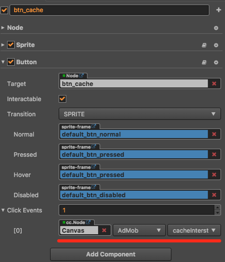

#SDKBOX for Cocos Creator

##Installation
Starting Cocos Creator 1.4 developer can install SDKBOX plugin from Extension Store

<iframe src='https://gfycat.com/ifr/ConsciousSomberGerenuk' frameborder='0' scrolling='no' width='640' height='360' allowfullscreen></iframe>

Once installed successfully, a new menu entry named "SDKBox" will be added to Cocos Creator 

##Integration
Before integrating SDKBOX plugins make sure you generate the iOS/Android build for your Cocos Creator projects first

<iframe src='https://gfycat.com/ifr/EntireLinearBeetle' frameborder='0' scrolling='no' width='640' height='360' allowfullscreen></iframe>


##After Intergration

### Add buttons

add two button to scene, design ui like follow:


### Create JavaScript Component

create javascript commponent, name it `AdMob.js`, i will integrate `AdMob` the this project. add three empty function to `AdMob.js`, also add admob initialize code in `onLoad` function like follow:

```js
cc.Class({

    ...

    onLoad: function () {
        //Add this line to onLoad
        this.admobInit();
    },

    ...

    admobInit: function() {
        //finish it after import admob, let it empty for now
    },

    cacheInterstitial: function() {
        //finish it after import admob, let it empty for now
    },

    showInterstitial: function() {
        //finish it after import admob, let it empty for now
    },

    ...

});
```

### Attach AdMob.js to Canvas


### associate button click event to AdMob.js




### Configuration AdMob

* configure `./build/jsb-default/res/sdkbox_config.json` with your ad id

`Important`: Make sure backup `sdkbox_config.json`, `./build/jsb-default/res` will be removed every time after Build Project in Cocos Creator build windows

### Finish AdMob.js empty function

```js
cc.Class({

    ...

    admobInit: function() {
        if(cc.sys.isMobile) {
            var self = this
            sdkbox.PluginAdMob.setListener({
                adViewDidReceiveAd: function(name) {
                    self.showInfo('adViewDidReceiveAd name=' + name);
                },
                adViewDidFailToReceiveAdWithError: function(name, msg) {
                    self.showInfo('adViewDidFailToReceiveAdWithError name=' + name + ' msg=' + msg);
                },
                adViewWillPresentScreen: function(name) {
                    self.showInfo('adViewWillPresentScreen name=' + name);
                },
                adViewDidDismissScreen: function(name) {
                    self.showInfo('adViewDidDismissScreen name=' + name);
                },
                adViewWillDismissScreen: function(name) {
                    self.showInfo('adViewWillDismissScreen=' + name);
                },
                adViewWillLeaveApplication: function(name) {
                    self.showInfo('adViewWillLeaveApplication=' + name);
                }
            });
            sdkbox.PluginAdMob.init();
        }
    },

    cacheInterstitial: function() {
        if(cc.sys.isMobile) {
            sdkbox.PluginAdMob.cache('gameover');
        }
    },

    showInterstitial: function() {
        if(cc.sys.isMobile) {
            sdkbox.PluginAdMob.show('gameover');
        }
    },

    ...

});
```

### Build Cocos Creator Again

Menu->Project->Build or (Command + Shift + B)
Build->Compile
make sure AdMob.js will sync to `./build/jsb-default` project

### Build & Run

* open `./build/jsb-default/frameworks/runtime-src/proj.ios_mac/SDKBoxTutorial.xcodeproj` with Xcode
* run `cocos run -p android ` at `./build/jsb-default` to build android


### IMPORTANT

Make sure backup `sdkbox_config.json` if you delete `./build/jsb-default` folder, your sdkbox configuration will be lost


