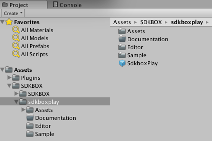

<h1>SdkboxPlay Documentation.</h1>

For more information, visit our website @ [www.sdkbox.com](http://cocos2d-x.org/sdkbox)

<h2>Importing SDKBOX Play</h2>

First import the ```SdkboxPlay``` unity package into your project. This will create two directories in Assets, one for sdkboxplay and one for sdkbox. If you have other SDKBOX plugins installed, they will appear here too. A plugins directory will also be present if you have other SDKBOX plugins. This directory contains files for iOS and Android.



To begin using sdkboxplay, find the sdkboxplay prefab in the Assets/SDKBOX/sdkboxplay directory.

Create an instance of the sdkboxplay prefab in the scene where you want to use the sdkboxplay package. You should only have a single instance of this prefab at any time.

Select the sdkboxplay game object in the hierarchy and in your inspector pane you can configure the object.

<h2>Configuring the sdkboxplay Plugin</h2>


<h3>Description of Fields</h3>

<h5>Leaderboadrds</h5>

Leaderboards are defined on the respective platform’s developer console. To keep things simple, the current SdkboxPlay implementation does not allow to define group leaderboards from iOS. For both platforms, an arbitrary number of leaderboards can be defined. Though both, GooglePlay and GameCenter define leaderboards in the same way, in the runtime there are some differences:

+ Google Play creates automatically 3 time frames for each leaderboard: daily, weekly and all time best scores.
+ Game Center creates just one timeframe.

This will be resembled on the observer methods for leaderboard operations as described below.

<h5>Achievements</h5>

Achievements are defined on the respective platform’s developer console.
There are differences in concept between GooglePlay and GameCenter’s achievements:

+ Google Play differentiates between achievements, and incremental achievements. Google keeps track of incremental achievements progress. Achievements are achieved only once.
+ For Game Center, all achievements are incremental, but Game center does not keep track of its progress. Achievements are expected to be achieved during a game session. Achievements can be set to be unlocked several times.
+ Google Play has the notion of newly unlocked achievement (first time unlocked), and Game Center has the notion of recurrently unlockable achievement. Both concepts are complementary.

To keep things consisten, SdkboxPlay API:

+ Allows you to define non-incremental achievements. For ios, are submitted with an incremental value of 100, which means it will be unlocked.
+ Allows you to define Incremental achievements. In Google play, incremental achievements have defined their unlocking value on the application console. 
+ For consistency, it is recommended to define Google Play’s achievements with a count of 100. This is the value Game Center expects to be reached to unlock an achievement.

<h5>Debug</h5>

Specifies debug mode

<h5>Connect_on_start</h5>

Specifies if connect when app start

<h2>Handling sdkboxplay Events</h2>

In the ```Callbacks``` section of the sdkboxplay script inspector pane, you can click ```+``` to add a subscriber, and specify the object, and method that you would like to have invoked.


<h2>sdkboxplay API</h2>

```

void submitScore(string name, int score)

void showLeaderboard(string name)

void unlockAchievement(string name)

void incrementAchievement(string name, int increment)

void showAchievements()

void signin()

void signout()
		
```

<h2>Additional iOS Instructions</h2>
On some older versions of Unity, the static libraries in sdkboxplay/Assets/Plugins/iOS do not get included in the XCode project. In this case they need to be moved to Assets/Plugins/iOS or added to the XCode project manually.
