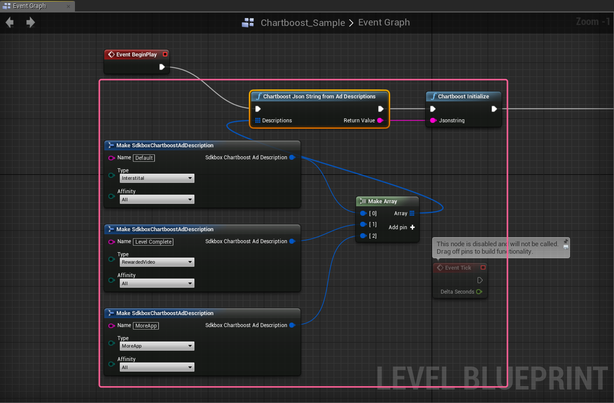
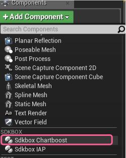
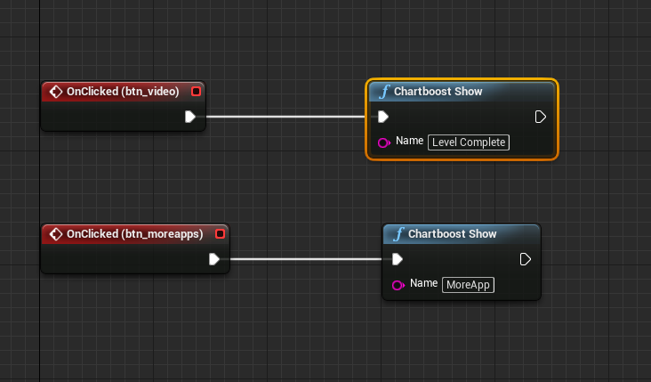

<h1>Chartboost Documentation.</h1>

For more information, visit our website @ [www.sdkbox.com](http://cocos2d-x.org/sdkbox)

<h2>Setting up your Unreal Engine 4 project for Chartboost</h2>

Before you start, make sure you have the following items

* A Chartboost account, sign up [here](https://www.chartboost.com)
* [An app in your dashboard](https://answers.chartboost.com/hc/en-us/articles/200797729-Your-First-App-and-Campaign-)

<h2>Installing the SDKBOX Chartboost Plugin for UE4</h2>

Download the SDKBOX Chartboost Plugin from the SDKBOX UE4 website [here](http://www.sdkbox.com/unreal)

<h3>In Your Engine</h3>

1. Unpack the files into ```Engine/Plugins/SDKBOX/```
2. Run the GenerateProjectFiles script in the Engine root.
3. Open your engine project file and build the editor.

<h3>In Your Code Project</h3>

1. Unpack the files in your ```[Project Root]/Plugins/SDKBOX``` directory.
2. Relaunch the editor. This will prompt you to build the plugin for the editor, go ahead and accept to build the plugin and continue launching the editor.

<h2>Enable the Plugin</h2>

Goto Settings -> Plugins and scroll down to Project if you have added the plugin to your code project, otherwise it will be part of Built-In.


Make sure the the Enabled checkbox is checked. You may have to restart the editor after this step.

<h2>Initialize the Plugin</h2>

It is important to call the SDKBOX Chartboost initialization method early, or at least before you call any other methods. You can do this by calling it from your Game Instance Init event, or your first scene's Begin Play event.

The init method takes a JSON string as a parameter. You can pass a raw string if you would like, but you can also add the Ad descriptions in the Blueprint editor and build the string at runtime.


To add products in the Blueprint editor, first add a variable ```Ads``` of type ```Chartboost Json String From Ad Descriptions``` and make it an Array.

Now you can add Ads in the editor by clicking on Products and adding items to the Default Value in the Details pane.



You can now create a function to convert the Ads variable into a JSON string that you can feed into the initialize function (pictured above).

<h2>Handling Events</h2>

You can handle events from the plugin by adding the Sdkbox Chartboost component to an actor in your scene.




<h2>Show Chartboost Ad</h2>




