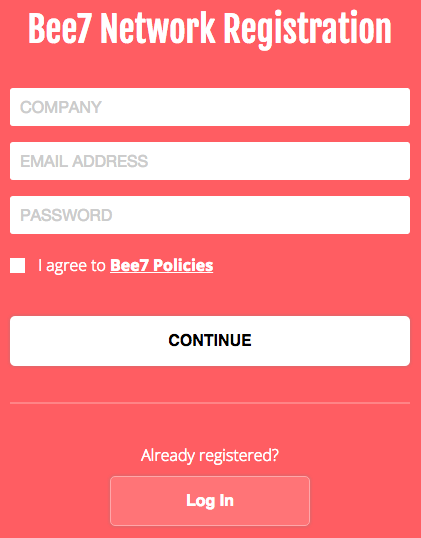
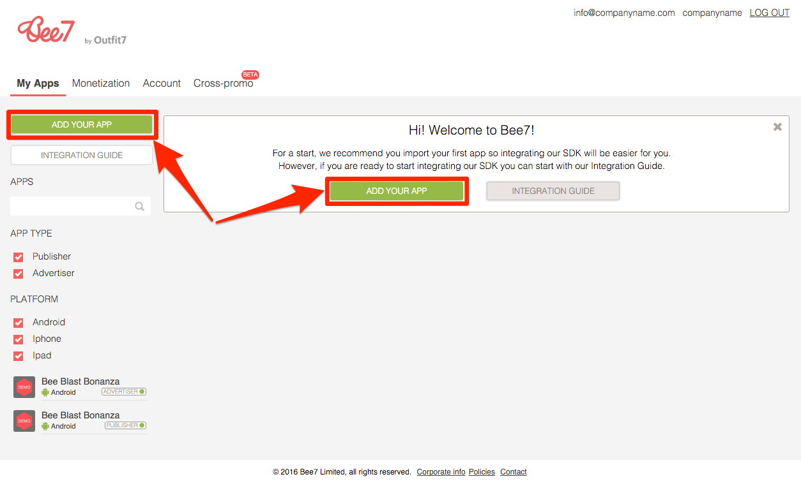
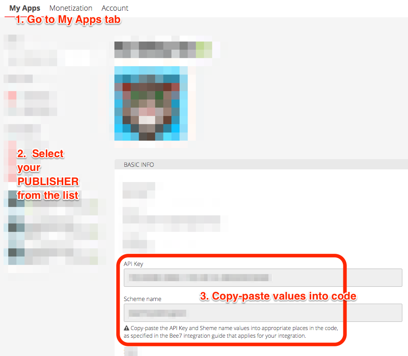

[&#8249; Bee7 Doc Home](./)

<h1>Bee7 Integration Guide</h1>
<<[../../shared/-VERSION-/version.md]

##Intro
1.Before you start integrating the SDKBOX Bee7 plugin, you need to register with Bee7:

  a) [Create an account on Bee7's dashboard](https://dashboard.bee7.com/#/signup)

  

  b) [Register your apps in Bee7](http://bee7.com/integrate/bee7-app-registration/) using the dashboard account

  

2.The API key and Scheme name values that you will bee needing in the code can be found in the dashboard, under your app's details.



3.Once the integration of the SDKBOX Bee7 plugin is complete, <a href="mailto:support@bee7.com">contact Bee7 Support</a> to activate your app for production.

##Prerequisites
* __For Android, Bee7 requires a minimum version of 4.0.3. This version is newer than what the other SDKBOX plugins require.__

* __For iOS, Bee7's game wall currently supports only portrait orientation.__

##SDK Version
<<[../version]

##Integration
Open a terminal and use the following command to install the SDKBOX Bee7 plugin. Make sure you setup the SDKBOX installer correctly.
```bash
$ sdkbox import bee7
```

<<[../../shared/notice.md]

<!--## Configuration
<<[../../shared/sdkbox_cloud.md]
<<[../../shared/remote_application_config.md]-->

### JSON Configuration
SDKBOX Installer will automatically create a sample configuration `sdkbox_config.json` for you

Here is an example of the Bee7 configuration you can enable/disable debug mode for Bee7 here

```json
"Bee7":
{
    "debug":true,
    "key":"FE74A9C4-1288-4F6F-8D6E-C365699F2C72"
}
```

<!--<<[sdkbox-config-encrypt.md]-->

##Usage

##Extra steps
The following step assumes you already registered at [Bee7](https://dashboard.bee7.com/#/signup), created a new APP, and activated TEST state.

###Setup iOS
* Modify `Info.plist`, add URL Schemes:

	__Target -> Info -> URL Types__:

	1. click "+"
	2. fill "URL Schemes" with "your bee7 scheme". For testing, you can try "bee7orgcocos2dxbee7sample".

###Setup Android
* Open `AndroidManifest.xml` and replace `_replace_with_your_bee7_scheme_` with your `bee7 scheme`
* Open `project.properties` and change target to `target=android-21`

<<[usage.md]

<<[api-reference.md]

<<[manual_integration.md]

<<[manual_ios.md]

<<[../../shared/manual_integration_android_and_android_studio.md]

<<[manual_android.md]

<<[extra-step.md]

<<[../../shared/manual_integration_google_play_step.md]

<<[proguard.md]
