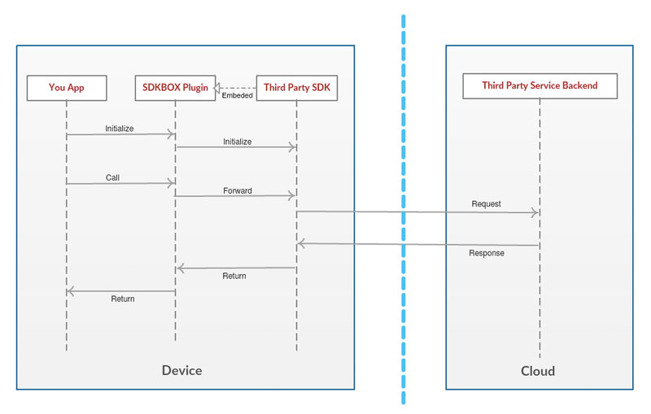
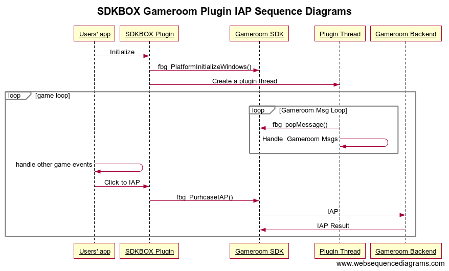

[&#171; SDKBOX Home](http://sdkbox.com)

<h1>Gameroom Plugin</h1>

## Preface
Facebook Gameroom is an entertainment platform based on **Windows(only)**, including thousands of games downloading, players community, games publishing and other more services.

Gameroom SDK is officially offered by Facebook in a bid to make developers releasing their games to Gameroom convenient. **But Now the SDK is in Beta.**

As SDKBOX should offer more plugins to serve more users, our team will pack the Gameroom SDK as a SDKBOX Plugin, uniforming its APIs and optimizing it on Cocos2d-X and other engines.

## Integration Guides

### For games using Cocos2d-x 3.x
*   [The C++ version](./v3-cpp.md)
*   [The Javascript version](./v3-js.md)

### For games using Cocos Creator
<!--*   [Integration with Cocos Creator](./v3-cc)-->

>   Cocos Creator is not fully prepared for Gameroom Plugin. But the beta testing is going well, the support of this plugin will coming soon.

## Sample Project

[A demo project on github](https://github.com/sdkbox/sdkbox-sample-gameroom)

## Gameroom Plugin Design
A serial of plugins in SDKBOX have similar architecture:

First, Initialize SDKBOX and set callback listeners via SDKBOX Plugins APIs; Secondary, calling SDKBOX APIs to execute the original SDK function directly; And then the results and events of the execution will be handled by callback Listeners set in first step.

This illumination shows the process clearly(from [http://docs.sdkbox.com/en/](http://docs.sdkbox.com/en/)):

The original SDKs usually create **another thread** to callback Listeners, in the light of that, SDKBOX don't need to care about how to implement callback APIs, just encapsulate the APIs and offer them to users. it is more different from Facebook Gameroom SDK.

According to Facebook Gameroom SDK docs, though it doesn't demonstrate directly, the SDK can't handle the result and events in an individual thread but in game loop.

For example, with Facebook Gameroom SDK, the implementation of IAP could be like this:

As SDKBOX can't make any impacts to Game Engines, ex., Cocos2d-X, in other words, any internal game loop can't be affected by SDKBOX plugins. it is a big headache in encapsulation of Gameroom SDK. SDKBOX Gameroom Plugin should **create a new thread** to handle Gameroom Messages(callbacks).

The SDKBOX Gameroom Plugin should work as below:

## Finished Functions

Now, SDKBOX Gameroom Plugin has these functions:

*   user login
*   *feed shared (function test normally but the returned value is always 0)*
*   IAP
    *   IAP with product ID
    *   IAP with a URL link
    *   *purchase premium version or license (function test failed in Gameroom SDK)*
*   *App Events (crash in Gameroom SDK when no user login)*
*   App Request
    *    send requests to fixed person
    *    send requests to chosen person via a Facebook dialog

>   The functions in *italic* have some problem(Facebook Gameroom SDK is still in Beta version), which needs help from Facebook.

