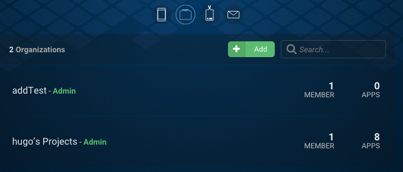

[&#8249; Share Doc Home](./)

<h1>Share Integration Guide</h1>
<<[../../shared/-VERSION-/version.md]

##Integration
Open a terminal and use the following command to install the SDKBOX Share plugin. Make sure you setup the SDKBOX installer correctly.
```bash
$ sdkbox import share
```

<<[../../shared/notice.md]

<!--## Configuration
<<[../../shared/sdkbox_cloud.md]
<<[../../shared/remote_application_config.md]-->

### JSON Configuration
SDKBOX Installer will automatically inject a sample configuration to your `res/sdkbox_config.json`, that you have to modify it before you can use it for your own app

Here is an example of the Share configuration, you need to replace `<key>`, `<secret>` item with your specific [Twitter](http://apps.twitter.com/) account information.
```json
"Share":{
    "platforms":{
        "Twitter":{
            "params": {
                "key":"BUJTV6NEM7BAhhm82B12VbKGy",
                "secret":"haVcKarM96Sr4390XLQoHjyRUSyuHdkMX6letcc38h8TOWyiR9"
            }
        }
    }
}
```

### fabric key in AndroidManifest
you need replace `<api_key>` with your [fabric organization](https://fabric.io/settings/organizations) item in AndroidManifest.xml
``` xml
<meta-data
            android:name="io.fabric.ApiKey"
            android:value="api_key" />
```

### How get fabric organization apikey

- create a organization in [fabric organization](https://fabric.io/settings/organizations)

maybe look like the following


- and then, get orgranization key

maybe look like the following


<!--<<[sdkbox-config-encrypt.md]-->

##Usage
<<[usage.md]

<<[api-reference.md]

<<[manual_integration.md]

<<[manual_ios.md]

<<[../../shared/manual_integration_android_and_android_studio.md]

<<[manual_android.md]

<<[extra-step.md]

<<[proguard.md]
